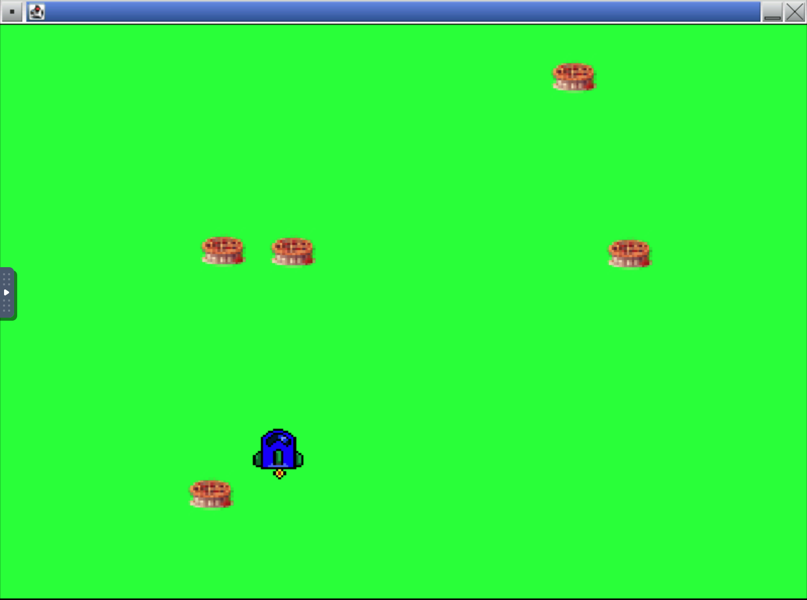

# Pie Eater

This fork of [Ariana's Pie Eater game](https://singhari.github.io/pieEaterGame/) adds configuration for running the game online using Github codespaces. 

First, from this repository webpage, click on the green code button.  . In the popup window,

 

Click on the green 'Create Codespace' button. Creating the codespace will take a few minutes, and when it is done, you will get a Visual Studio Code window. Tne next steps will focus on the 'ports' tab in the bottom pane, and the run/debug button, in the left side menu. Both are marked in red in the image below:

 

## Open a screen

The VSCode editor you are using is running on a remote server, which does not have a screen. So we have to use a virtual screen, provided by a program called VNC. This screen will appear in a pane in VSCode or browser window. Here is how you open this window. 

In the bottom pane of the VSCode window, click on the "PORTS" tab. 

 

Hover over the "Forwarded Address" for port 6080. You will see a small icon
that looks like a globe. This will open a new browser window with a "noVNC" logo. 

 

Click on "Connect", then enter the password: "code4life"

Now you have a virtual screen running. When your program writes to the screen, it will show up in this window. 

 # Run the program

To run the program, click on the "Run Debug" icon in the left side menu" 

 

At the top of the screen you will see the "RUN AND DEBUG" menu.

 

Click on the down arrow to open the menu. 

 

The select "PieEater", the program that we are viewing the source code for. Then click on the green run arrow. Look in the lower right for an other popup, if there is one, click "Yes". 

Look in the virtual window you opened earlier. You should see the game running! 

 

